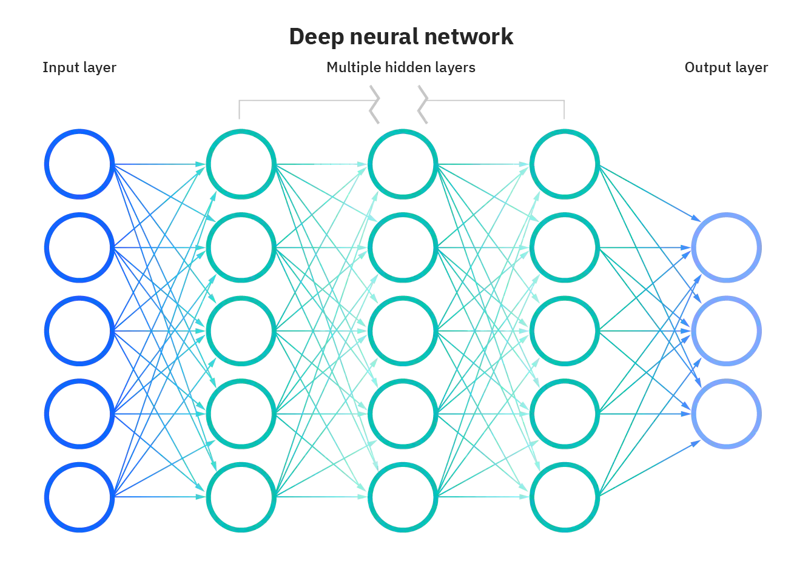
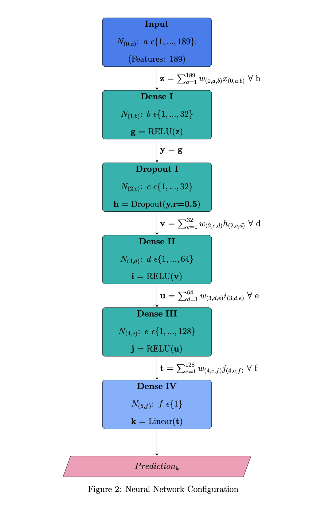

Academia explains my research outcomes

## **Finance (Honours): Long-Short Hedge Portfolios & Deep Neural Networks**

[]

### **Theory & Hypotheses**

Machine learning models optimise a loss function by iteratively finetuning model parameters to minimise the difference between actual observations & predicted outcomes. Portfolio managers seek to maximise excess returns while diversifying idiosyncratic risk with trading strategies, e.g., Trading long-short equity hedge portfolios.

I reconfigured a neural network to directly use a hedge portfolio loss function to maximise excess returns of one-month lead long-short hedge portfolios.

The analysis tested the reconfigured model's ability to generate statistically and economically significant results, outperform standard configurations, and align with a portfolio manager's mandate. Hypothetically,

1. Can you reconfigure a neural network from maximisation objectives given: **Argmax $$f(x)$$ = Argmin $$-f(x)$$**?
2. Given the fundamental theory behind these models, A hedge portfolio loss function will not outperform standard minimisation functions?

### **Data**

I used a global factor dataset published by [Jensen et al. (2021)](https://github.com/bkelly-lab/ReplicationCrisis) using [CRSP](https://crsp.org) and [Compustat](https://www.spglobal.com/marketintelligence/en/?product=compustat-research-insight) from S&P Global. The dataset includes individual firm-year observations across countries with a 1-month holding period factor for each characteristic, e.g., book-to-market ratio. A factor represents a characteristic's contribution to a portfolio's excess returns if included in a long-short zero net investment strategy calculated by:

1. Sorting stocks into terciles for each characteristic for each country and month;
2. Defining factors by high-tercile returns minus low-tercile returns to align with a zero-cost investment strategy, calculating each factor's alpha using an Ordinary least squares (OLS) regression on a constant and region's market return;
3. Clustering factors by signing factors and equally weighting returns of factors within a specific cluster.

### **Model Architecture**

An input, output, and multiple hidden layers contribute to standard deep neutral network topography (left). Using Google's [Tensorflow](https://www.tensorflow.org/) open-source machine learning platform, I configured a deep neural network with an input layer, an output layer, three dense hidden layers, & one dropout hidden layer to mitigate overfitting (right).

|  |  |

### **Loss Function**

The hedge loss function is a non-convex function, weighted proportionally to one month lead excess returns, using a monotonically non-increasing ranking function. Note: I use $$\|\|$$ to represent rather than a single bar in expression given limitations in markdown syntax.

Firstly, I define a standard monotonical ranking function as:

$$R(y_{i,t})$$

Secondly, I mathematically express long (L) and short (S) portfolios where L is set of long positions, S is a set of short positions, $$y_{i,t}$$ is the excess return for a given asset (i) in a month (t) with u and v lower and upper bounds on excess returns, respectively:

$$L=\{ y_{i,t} \| R(y_{i,t})\leq u\}$$

$$S = \{ y_{i,t} \| R(y_{i,t})\geq v\}$$

$$0 < u \leq \|y\|$$

$$0 < v \leq \|y\|$$

$$u < v$$

Next, I define a hedge portfolio:

$$H_{t} = \frac{1}{\|L\|}\sum_{i\epsilon L} y_{(i,t)} - \frac{1}{\|S\|}\sum_{i\epsilon S} y_{(i,t)}$$

The variation of hedge portfolio and ranking functions permeate. I use a monotonical non-increasing ranking function proportionally weighted to one month lead excess returns as follows:

$$R(\hat{y})= W$$

$$W:=\frac{\hat{y}}{\vec{\textbf{1}} \hat{y}}$$

$$\hat{y}=X^{T} \hat{\theta}$$

$$f_{\hat{\theta}}(X) = (\frac{X^{T} \hat{\theta}}{\vec{\textbf{1}}X^{T} \hat{\theta}})^\top X^{T} \hat{\theta}$$

W is a vector of weights, $$\hat{y}$$ is a vector of predicted outcomes, $$\hat{\theta}$$ is a matrix of estimated parameters in the neural network, and X is the global factor dataset.

Stochastic gradient descent is one of the most common optimisation techniques applied to machine learning algorithms. It is an iterative technique to train models. The algorithm works as follows:

1. Determines the partial derivatives of your objective function with respect to each feature.
2. Selects a random combination of parameters in the feature space as a starting point.
3. Updates partial derivative functions using the parameters above.
4. Calculates step size for each feature: **step size = gradient x learning rate**
5. Calculates new parameters by: **new = old - step size**
6. Repeats until it locates global or local minima in feature space.

Finally, I express the monotonical non-increasing ranking function's partial derivative. Tensorflow will calculate this function using Keras Backend as the module can automatically differentiate novel functions:

$$\frac{\partial f_{\hat{\theta}}(X)}{\partial \hat{\theta}} = \frac{\partial ((\frac{X^{T} \hat{\theta}}{\vec{\textbf{1}}X^{T} \hat{\theta}})^\top X^{T} \hat{\theta})}{\partial \hat{\theta}}$$

$$\frac{\partial (f_{\hat{\theta}}(X))}{\partial \hat{\theta}} = \frac{1}{(\hat{\theta}^\top X \vec{1})} X X^\top \hat{\theta} +\frac{1}{\vec{1}X^\top \hat{\theta}} XX^\top \hat{\theta} -\frac{1}{(\hat{\theta}^\top X \vec{1})^{2}} \hat{\theta}^\top XX^\top \hat{\theta} X \vec{1}$$

I compare the monotonic hedge portfolio function to two mean squared error loss functions; Tensorflow's inbuilt function and a custom mean square error loss function. This comparison aims to test the performance of the hedge portfolio function and validate TensorFlow's Keras Backend module in programming custom objective functions.

In summary:

| Expression                    | Function                                                                                                                                                                                                                                                                                   |
| ----------------------------- | ------------------------------------------------------------------------------------------------------------------------------------------------------------------------------------------------------------------------------------------------------------------------------------------ |
|                               | **Mean Squared Error**                                                                                                                                                                                                                                                                     |
| --                            | --                                                                                                                                                                                                                                                                                         |
| Loss Function                 | $$f_{\hat{\theta}}(y, X)= \frac{\vec{1}}{\vec{1}^{T}\vec{1}} (\textbf{y} - X^{T}\hat{\theta})^{\circ 2}$$                                                                                                                                                                                  |
| Objective                     | $$\text{argmin}_{\hat{\theta}}: (f_{\hat{\theta}}(y, X))$$                                                                                                                                                                                                                                 |
| Partial Differential Equation | $$\frac{\partial f_{\hat{\theta}}(y, X)}{ \partial \hat{\theta}} = \frac{\vec{1}}{\vec{1}^{T}\vec{1}} (-2(\textbf{y}-X^{T} \hat{\theta})^{\circ 1})$$                                                                                                                                      |
| --                            | --                                                                                                                                                                                                                                                                                         |
|                               | **Hedge Portfolio**                                                                                                                                                                                                                                                                        |
| ----------------------------- | --------                                                                                                                                                                                                                                                                                   |
| Loss Function                 | $$f_{\hat{\theta}}(X)= (\frac{X^{T} \hat{\theta}}{\vec{\textbf{1}}X^{T} \hat{\theta}})^\top X^{T} \hat{\theta}$$                                                                                                                                                                           |
| Objective                     | $$\text{argmax}_{\hat{\theta}}:(f_{\hat{\theta}}(X))$$                                                                                                                                                                                                                                     |
| Partial Differential Equation | $$\frac{\partial (f_{\hat{\theta}}(X))}{\partial \hat{\theta}}  = \frac{1}{(\hat{\theta}^\top X \vec{1})} X X^\top \hat{\theta} +\frac{1}{\vec{1}X^\top \hat{\theta}} XX^\top \hat{\theta} -\frac{1}{(\hat{\theta}^\top X \vec{1})^{2}} \hat{\theta}^\top XX^\top \hat{\theta} X \vec{1}$$ |

### **Infrastucture & Programming**

I used [Google's Cloud Platform](https://cloud.google.com/?hl=en) to manage datasets, train, validate, and test models. Cryptographic network protocols in the form of secure shells established remove connections from a local machine to the virtual machine to execute commands.

1. Set up a virtual machine on Google Cloud's Compute Engine. The instance was a n1-standard-8 machine with an Intel Broadwell Central Processing Unit (CPU) and a NVIDIA Tesla K80 Graphics Processing Unit (GPU).
2. Set up Google Cloud Storage buckets to store and manage large datasets.
3. Programmed a set of functions to implement:
   1. Set controls to monitor CPU & GPU memory usage, reconfigure GPU memory usage, and set the number of GPUs if required.
   2. Partition process feature set into a training, testing, and validation subsets on the virtual machine.
   3. Calculate risk-adjusted performance measures and fama-french factor pricing models to compare functions.
   4. Create feature lists and convert data frames into TensorFlow datasets.
   5. Create normalisation layers and encode numerical and categorical features in the feature set.
   6. Build a user-defined neural network using a generalised framework.
   7. Create and model learning curves using [neptune.ai](https://neptune.ai), an MLOps stack component for experiment tracking to log, organise, compare, register, and share all machine learning model metadata.
   8. Make predictions using the trained, tested, and validated model.
   9. Create classes defining mean squared error & hedge portfolio loss functions.

The hedge portfolio loss function follows:

```python
class custom_hp(tf.keras.losses.Loss):
"""Custom Hedge Portfolio Function Class

        Args:
            tf (env): Tensorflow keras losses environment
        """

        def __init__(self, extra_tensor=None, reduction=tf.keras.losses.Reduction.AUTO, name='custom_hp'):
            """Initialisation of custom hedge portfolio function

            Args:
                extra_tensor (tensor, optional): Original tensor format. Defaults to None.
                reduction (red, optional): Reduction. Defaults to tf.keras.losses.Reduction.AUTO.
                name (str, optional): name of function. Defaults to 'custom_hp'.
            """
            super().__init__(reduction=reduction, name=name)
            self.extra_tensor = extra_tensor

        def call(self, y_true, y_pred):
            """Call for hp loss function

            Args:
                y_true (tf): Tensor of realisations
                y_pred (tf): Tensor of predictions

            Returns:
                : Loss
            """
            extra_tensor = self.extra_tensor
            # Calculates sum over vector tensors
            y_true_sum = K.sum(y_true)
            y_pred_sum = K.sum(y_pred)
            #
            y_true_weights = (y_true/y_true_sum)
            y_pred_weights = (y_pred/y_pred_sum)
            # Transpose the weights
            y_true_transposed = K.transpose(y_true_weights)
            y_pred_transposed = K.transpose(y_pred_weights)
            # Multiply by the weights
            y_true_loss = K.dot(y_true_transposed, y_true)
            y_pred_loss = K.dot(y_pred_transposed, y_pred)
            loss = -1*(y_pred_loss)
            return loss

```

### **Outcomes**

There were a handful of contributions:

1. It is feasible to reconfigure neural networks for maximisation and use custom loss functions with the TensorFlow Keras module. However, the economic significance still needs to be answered.
2. The factor portfolio dataset is suitable for this analysis, given its size and quality.

However, a few limitations persist:

1. Only one neural network configuration is considered. Simulating different architectures would improve analysis.
2. Does not compare against other optimisation techniques, e.g., reinforcement learning, dynamic programming etc.
3. The dataset required condensing, given its size and cost to use the entire set.

Both hypotheses have proven true.

1. Can you reconfigure a neural network from maximisation objectives given: **Argmax $$f(x)$$ = Argmin $$-f(x)$$**? **Yes**
2. Given the fundamental theory behind these models, A hedge portfolio loss function will not outperform standard minimisation functions? **Yes**

### **Resources**

- [Tensorflow](https://www.tensorflow.org/)
- [Google Cloud Platform](https://cloud.google.com)
- [Neptune.ai](https://neptune.ai)
- [Classes and Modules]({{ site.url }}/downloads/cmcd398-finance-honours-code-listing.pdf)
- [Code Repository](https://github.com/CMCD1996/finance-honours)

## **Engineering (Honours): Energy System Build & Design**

My research project explored developing an open-source energy modelling tool for users to design custom energy systems. The model intends to inform policy and investment in sustainable technology. The model uses Python, Excel, GNU Mathprog and IBM Watson Machine Learning services.

[]({{ site.url }}/downloads/gocpi.pdf)

### GOCPI Information, References and Required Software

- [OseMOSYS](http://www.osemosys.org/)
- [TIMES (Reference)](https://iea-etsap.org/index.php/etsap-tools/model-generators/times)
- [IBM Academic Initiative](https://www.ibm.com/academic/home)
- [IBM ILOG CPLEX Optimizer](https://www.ibm.com/analytics/cplex-optimizer)
- [IBM Cloud](https://www.ibm.com/cloud)
- [IBM Watson Machine Learning](https://www.ibm.com/cloud/machine-learning)
- [GNU Linear Programming Kit](https://www.gnu.org/software/glpk/)
- [GOCPI GitHub Repository](https://github.com/CMCD1996/GOCPI)
- [OseMOSY GitHub Repository](https://github.com/OSeMOSYS/OSeMOSYS)

## **Prototype Wind Turbine**

I led a four-person team tasked to design, build, and test a wind turbine at 140 rpm. Simulation tested Blade profile design using MATLAB and Xfoil to optimize profile aerodynamics. Our team modelled optimal blade profiles in Dassault Systemes Solidworks, laser cut the design from sheets of Perspex and wrapped six blades fastened onto a hub and spoke mechanism connected to a frame in a wind tunnel.

The optimal blade profile design maximized the power coefficient ($$C_p = \frac{P_E}{P_T}$$) underpinning blade aerodynamics. The mathematical equations related to optimizing blade aerodynamics follow:

Equations:

|            Variable             |                                       Equation                                       |
| :-----------------------------: | :----------------------------------------------------------------------------------: |
|          Rotor Radius           |                $$R=\sqrt{\frac{2P_s}{C_p \eta \rho \pi V_{u}^{3}}}$$                 |
|         Tip Speed Ratio         |                         $$\lambda_r = \frac{\Omega_r}{V_u}$$                         |
|        Local Wind Angle         |                 $$\Phi = \frac{2}{3}tan^{-1}(\frac{1}{\lambda_r})$$                  |
| Chord Length with Wake Rotation |                       $$c = \frac{8 \pi r}{B C_L}(1 - \Phi)$$                        |
|       Blade Setting Angle       |                  $$ \beta = \frac{180}{\pi}(cos (\Phi) - \alpha)$$                   |
|       Normal Co-efficient       |                       $$C_n = C_L cos(\Phi) + C_D sin(\Phi)$$                        |
|     Tangential Co-efficient     |                       $$C_t = C_L sin(\Phi) - C_D cos(\Phi)$$                        |
|             Factor              | $$ F = \frac{2}{\pi}cos^{-1}(e^{-f}) \text{ where } f = \frac{B(R-r)}{2rsin{\Phi}}$$ |
|        Blade Solidarity         |                         $$ \sigma^{'} = \frac{Bc}{2 \pi r}$$                         |
|     Axial Induction Factor      |             $$a = \frac{\sigma^{'} C_n}{4Fsin^{2}(\Phi)+\sigma^{'}C_n}$$             |
|         Tangential Load         |                 $$\frac{1}{2}\rho \frac{V_{u}^{2}}{sin^{2}(\Phi)}$$                  |
|       Incremental Torque        |                 $$\Delta Q_{i,i+1} = \int_{r_{i}}^{r_{i+1}}P_Trdr$$                  |
|         Extracted Power         |                                  $$P_E = Q \Sigma$$                                  |
|         Power Available         |                        $$\frac{1}{2}\rho \pi R^2 V_{u}^{3}$$                         |
|       Power Co-efficient        |                              $$C_P = \frac{P_E}{P_T}$$                               |

[]({{ site.url }}/downloads/turbine.pdf)

## **Transhipment Project**

I led a team of three in designing and building a series of models to inform transhipment operations. This project is modelled either using optimization, conceptual or simulation models. The optimization model is a linear optimization model, written in AMPL, to model fruit produce flows from producers to packhouses to markets. The model minimizes packaging and transportation costs across ten different demand forecasts. The conceptual and simulation models are alternatives to this optimization model. The objective function driving the optimization model follows:

$$ \sum\_{i} \sum\_{j} \sum\_{p} C\_{(i,j)} F\_{(i,j,p)} + \sum\_{m} \sum\_{h} N PC\_{m} B\_{(m,h)} $$

Where C is the cost to transport product between an origin (i) & destination (j) packhouse, F (Flow) is the number of product units to ship between origin and destination in a period (p), N is the number of periods, PC is packing cost for a packing machine (m), and B is the build costs for a packing machine in a packhouse (h).

[]({{ site.url }}/downloads/tranship.pdf)

## **Chulalongkorn International Business Case Competition (2019)**

I represented the University of Auckland Case Programme, competing against 20 teams worldwide to develop and present strategies for Line Mobile and Sea Thailand at the Chulalongkorn International Business Case Competition (CIBCC) in Koh Samui, Thailand. Our team presented our analysis on Sea Limited, placing 3rd in the competition.

[]({{ site.url }}/downloads/cibcc.pdf)

## **Programming**

I completed assignments to improve coding skills in Python, C++, MatLab, SQL, VBA, AMPL and Git. These assignments covered Eigen problems, Finite Differences, Non Linear Equations, Ordinary Differential Equations, Partial Differential Equations (PDE's) and Databases.

one example is an application of finite difference approximations to track heat flow. I model this flow using the following PDE:

$$\frac{\partial^{2}u }{\partial x^{2} } + \frac{\partial^{2}u }{\partial y^{2} } - \alpha \frac{\partial u }{\partial t } = 0 $$

[]({{ site.url }}/downloads/code.pdf)

## **Design**

I completed several design projects. One was designing, modelling, and rendering a household item in PTC Creo. I chose a Gillette fusion proglide razor. The second was an interface (team of five) to create user-defined catapult designs and three-dimensional Solidworks models from user designs (Individually). The user interface includes animations programmed in VBA and APIs to manipulate the 3D model.

[]({{ site.url }}/downloads/design.pdf)

## **Optimisation**

I completed several assignments to develop skills to solve optimisation skills. I covered dynamic programming, heuristics, decision making under uncertainty and set partitioning. Some examples follow:

First, using dynamic programming to evaluate whether to reject an applicant or hire the applicant and stop interviewing:

$$\hat{V}_{N} = \int_{0}^{\hat{V}_{N+1}} \hat{V}_{N+1} f(r)dr + \int_{\hat{V}_{N+1}}^{\infty} rf(r)dr$$

Second, calculating expected profit from a manufacturing process. Mean hitting times are calculated by considering the probability the product will reach a different state from another state on another process iteration. One transition probability matrix and five separate states were considered (unfinished, poor, good, scrap and average):

$$M_{ij} = 1 + \sum_{k=1}^{n} P_{ik} \times M_{kj} \text{ where } i \neq j$$

[]({{ site.url }}/downloads/optimisation.pdf)

## **Corporate Governance**

I completed assignments addressing corporate governance-related theories and applications.

[]({{ site.url }}/downloads/cmcd398-corporate-governance.pdf)

## **Literature Review & Proposals**

My literature review explores data science applications in private equity, intending to inform investment due diligence.

[]({{ site.url }}/downloads/cmcd398-lit-review-research-proposal.pdf)

## **Machine Learning & Corporate Culture**

I implemented Stanford's Core Natural Language Processing Algorithm to ascertain measures for corporate culture across NZX/ASX listed companies.
This assignment replicates the methodology implemented by Li et al. (2021), accessible on [Github](https://github.com/MS20190155/Measuring-Corporate-Culture-Using-Machine-Learning).

[]({{ site.url }}/downloads/cmcd398-ml-corporate-culture.pdf)

## **Technical Analysis**

I conducted technical analysis to inform empirical assignments. Methods include Fama-MacBeth regressions, co-integration testing, and Bollinger Band trading strategies.

[]({{ site.url }}/downloads/cmcd398-technical-analysis.pdf)
