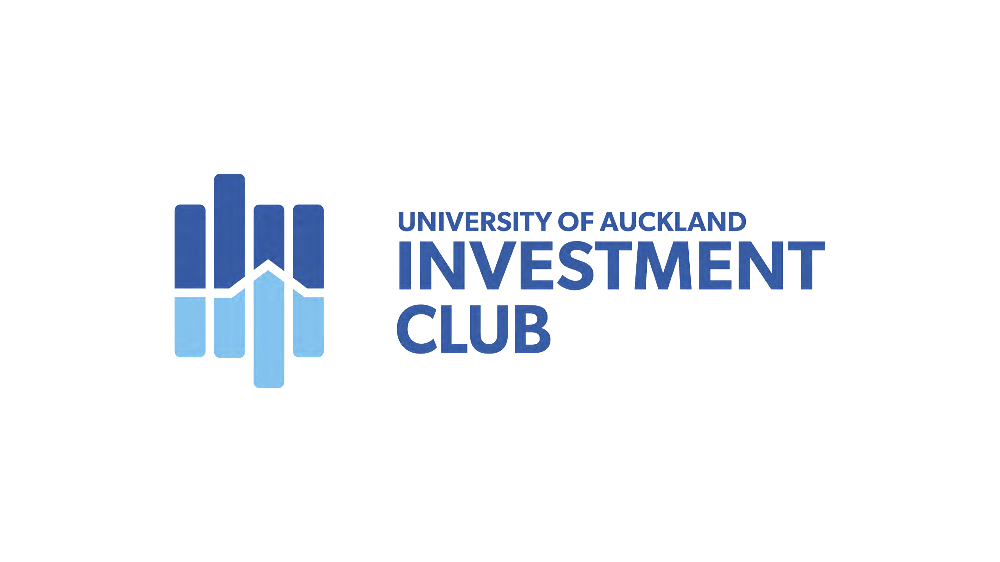

| | |
| | |

In 2020, I led the University of Auckland Investment Club (UAIC) as Co-President with [David Saul](https://www.linkedin.com/in/davidrjsaul/). We introduced several new initiatives while running several of UAIC's legacy offerings. I lead Competition, Investment Committee, Women Engagement Initiative, and Treasurer portfolios while managing sponsorship negotiations and external relationships. David worked in Bulletin, Marketing, Education and Social portfolios while overseeing the implementation of organisational changes.

### **Achievements**

1. Increased general membership by 30%.
2. Increased female general membership by 58%.
3. Published 14 bulletin editions (approximately 20 pages each), a series of opinion articles on finance-related topics.
4. Approved brokerage to create a fully functional Investment Fund. Additionally, we invested in four ASX/NZX equities.
5. Created the Women Engagement Initiative with a Mentoring Programme and two-part speaker series.
6. Continued to run the Citi Global Markets Challenge.
7. Created three new competitions: Jarden Stock Pitch Competition, Global From Day One Venture Capital Competition, and UBS New Zealand Investment Banking Competition.
8. Hosted seven education events annually to educate members on investing, ESG, Social Innovation from an Investor'sInvestor'sve, Qualitative Analysis and Valuation.
9. Rebranded the club and built efficient marketing channels.
10. Passed a brand new 14-page constitution to meet legal requirements and introduce new initiatives which incorporated three UNSDGs to inform events (Good Health and Wellbeing, Gender Equality and Quality Education).

I created an annual report intending to document our team's achievements and provide our successors a benchmark for future years. Click [here]({{ site.url }}/downloads/uaic-annual-report-2020.pdf) to view report.

### **Competitions**

I upgraded UAIC's annual Stock Pitch competition in partnership with Jarden. Click [here]({{ site.url }}/downloads/stock-pitch-competition.pdf) to view competition.

I created a Venture Capital competition in partnership with Global From Day One, a technology-based venture capital fund that invests in New Zealand hardware, software and deep technology startups. The competition had competitors follow their investment thesis to allocate $15m across three New Zealand startups with qualitative analysis supporting portfolio allocation. Click [here]({{ site.url }}/downloads/venture-capital-competition.pdf) to view competition.

I created an Investment Banking competition in partnership with UBS New Zealand. The competition has competing teams assess two large, influential transactions involving strategies. Teams assess the strategic rationale, offer context, synergies and performance of both transactions., and present to a panel of judges who ask finance-related questions. Click [here]({{ site.url }}/downloads/investment-banking-competition.pdf) to view competition.

### **Engagement**

I started the University of Auckland's Women Engagement Initiative to break down barriers discouraging women from considering careers in finance. This initiative includes a Mentoring Programme with 15 industry mentor-mentee pairings. We facilitated a two-part speaker series focusing on careers in finance, challenges in the workplace and the future of finance, emphasising financial technology. Click [here]({{ site.url }}/downloads/women-engagement-initiative.pdf) to view engagement pack.
