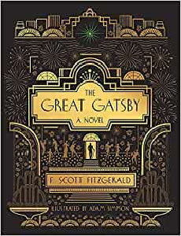
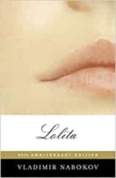
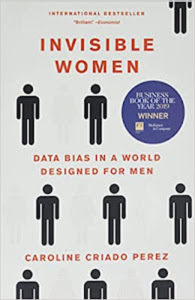
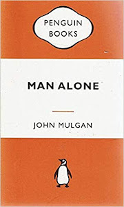
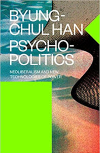
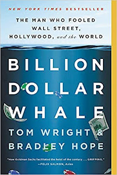
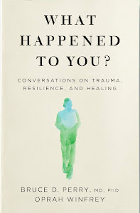
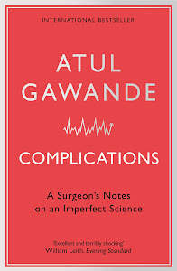
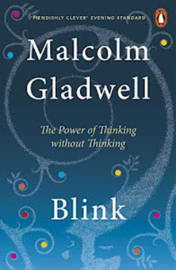

This page lists literature reviews and reading recommendations.

## **Library**

|  |  |  |  |  |

|  |  |  |  |  |

|  |  |  |  |  |

|  |  |  |  |  |

|  |  |  |  |  |

## **Currently Reading**
- [Capital in the 21st Century by Thomas Piketty](https://www.amazon.com/Capital-Twenty-First-Century-Thomas-Piketty/dp/0674979850)

## **Recommendations**
- [To Kill a Mockingbird by Harper Lee](https://www.amazon.com/Kill-Mockingbird-Harper-Lee/dp/0446310786)
- [Grit: The Power of Passion and Perseverance by Angela Duckworth](https://www.amazon.com/Grit-Passion-Perseverance-Angela-Duckworth/dp/1501111108)
- [Being Mortal by Atul Gawande](https://www.amazon.com/Being-Mortal-Illness-Medicine-Matters/dp/1250081246)
- [Too Big to Fail: The Inside Story of How Wall Street and Washington Fought to Save the Financial System and Themselves by Andrew Ross Sorkin](https://www.amazon.com/Too-Big-Fail-Washington-System/dp/0143118242)
- [Bad Blood: Secrets and Lies in a Silicon Valley Startup by John Carreyrou](https://www.amazon.com/Bad-Blood-Secrets-Silicon-Startup/dp/152473165X)

## **Upcoming Reading**
- [I Love Capitalism!: An American Story by Ken Langone](https://www.amazon.com/I-Love-Capitalism-American-Story/dp/073521624X)
- [Shoe Dog: A Memoir by the Creator of Nike by Phil Knight](https://www.amazon.com/Shoe-Dog-Memoir-Creator-Nike-ebook/dp/B0176M1A44)
- [Principles for Dealing with the Changing World Order: Why Nations Succeed and Fail by Ray Dalio](https://www.amazon.com/Changing-World-Order-Nations-Succeed/dp/1982160276)

## **Finished Reading**
- [CEO Excellence: The Six Mindsets That Distinguish the Best Leaders from the Rest by Carolyn Dewar, Scott keller, Vikran Malhotra](https://www.amazon.com/CEO-Excellence-Mindsets-Distinguish-Leaders/dp/1982179678)
- [The Great Gatby by F. Scott Fitzgerlad](https://www.amazon.com/Great-Gatsby-F-Scott-Fitzgerald/dp/0743273567)
- 
