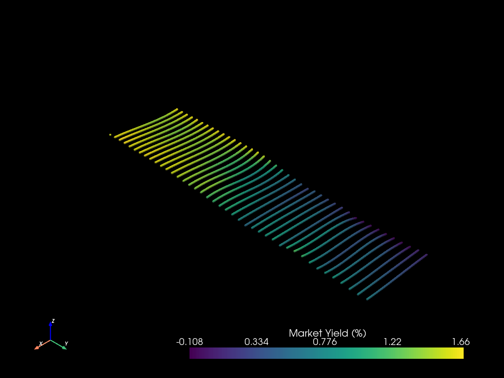
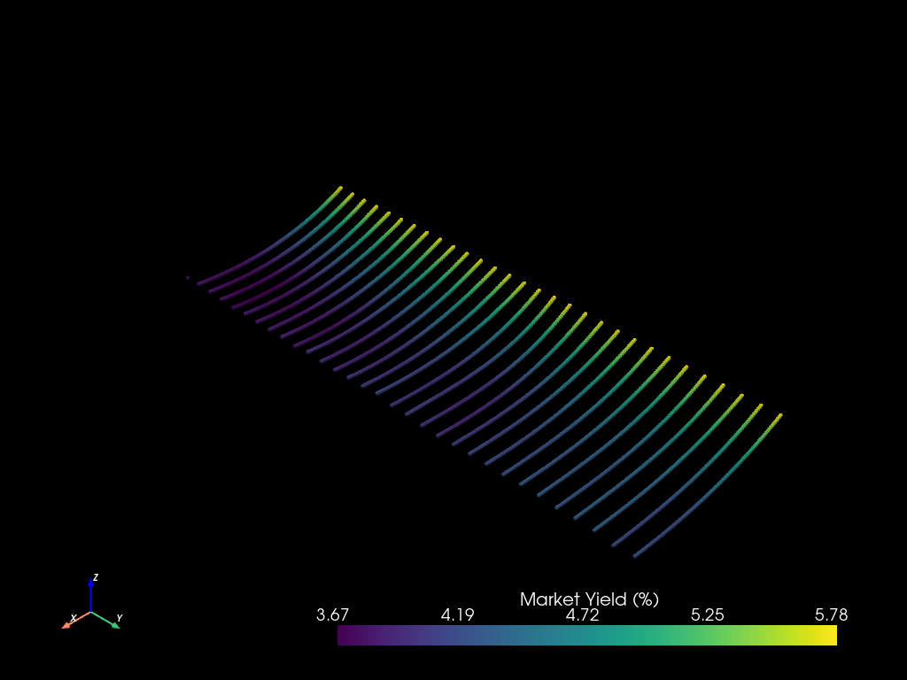
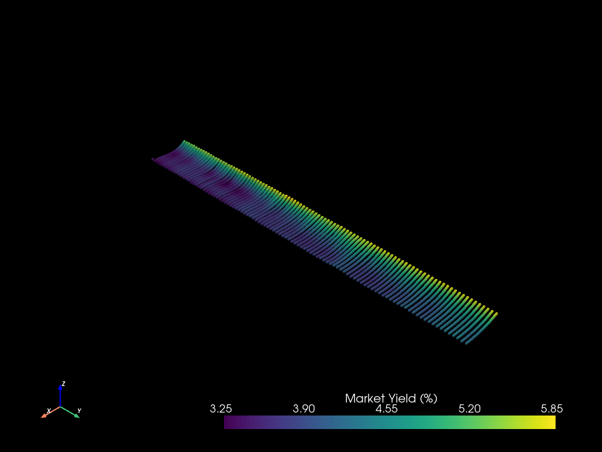
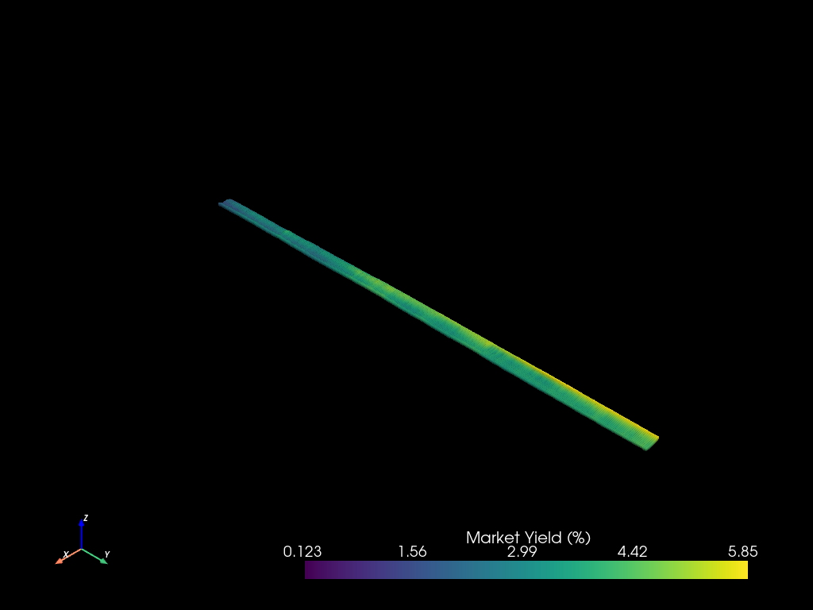

### **3D Modelling of US Market Yields**

**Introduction**

Modelling yield curves help gauge investor sentiment to risk. Interest rates on bonds with shorter maturities are usually lower than longer maturities as investors assume less risk in the short term. However, macroeconomic and geopolitical uncertainty can reverse this sentiment and invert the yield curve, an unusual but reliable predictor of an impending recession.

The United States of America Department of the Treasury issues securities (bills, notes, and bonds) at various constant maturities to finance US Federal operations. These are some of the safest investments available to investors, given their backing by both faith and credit of the US Government. Treasury securities are highly liquid, traded in primary and secondary markets, proxying for investor sentiment daily.

Yield curves are typically modelled at a point in time to gauge investor sentiment on a given day. By extension, modelling yield curves over time informs how investor sentiment changes throughout economic cycles. Hypothetically, sharp changes or dislocations in three-dimensional space ((x,y,z) = (maturities, time, yields)) would show the extent to which market news was unexpected, quantifiable by measurement of stress or strain on the modelled surface.

The Federal Reserve of Bank of St Louis publishes daily market yields on US Treasury securities across constant maturities, quoted on an investment basis, via their online economic research platform [FRED](https://fred.stlouisfed.org).

**Analysis**

I prepared, modeled, and visualised yield curves as follows:

1. Downloaded market yields for 3-month, 6-month, 1-year, 2-year, -year, and 10-year US Treasury securities up until 24th August 2023 from [FRED](https://fred.stlouisfed.org). Maturity, date, and market yield correspond to x, y, and z cartesian coordinates in the model, respectively.
2. Market yields are not reported every day. I removed missing values, reducing the data to a subset constrained by a user-specified number of observations. I isolated 30 observations between February 1st 2020, to April 1st 2020 (COVID), and 30, 100, and 365 latest observations to August 24th 2023. These are modelled in outcomes.
3. The set of US Treasury securities is discrete, given a few maturities. I used interpolation, a form of numerical analysis, to estimate market yields between each maturity. Numerical analysis is a branch of mathematics that solves continuous problems using numeric approximation. I fitted a polynomial of general form $$AX^3 + BX^2 + CX + D$$ as the dynamism of market pricing renders exact solutions impossible.
4. Visualised estimated market yields (z), observations (y), and maturities (x) as point clouds (see outcomes). A point cloud is a discrete set of points in three-dimensional space with points referenced by cartesian coordinates (x,y,z). Integrated heatmaps show how market yields change for each maturity. Sharp colour gradients highlight risk expectations between maturities at a point in time, and changing risk expectation for a specific maturity over time, on and between yield curves, respectively.

**Outcomes**

I model yield curves over the start of COVID and for 30, 100, & 365 days up to to August 24th 2023.
|  |  |
| **Figure 1:** 30 observations between February 1st 2020 to April 1st 2020 (COVID) | **Figure 2:** 30 observations to Aug 24th 2023 |
|  |  |
| **Figure 3:** 100 observations to Aug 24th 2023 | **Figure 4:** 365 observations to Aug 24th 2023 |

Figure 1 best highlights evolving investor sentiment given the visceral changes in the pandemic. US Treasury securities with longer term maturities had higher yields with percieved higher risk in the short term than shorter term maturities, at the start of February. However, the world came to terms with the full extent of COVID around the early March. The point cloud shows yields across all maturities plummeting, and an eventual subtle inversion of the yield curve. I caveat interpolating yield curves leading to negative yield estimates at the low end of maturities which does not reflect reality.

I spent the 2020/2021 summer practising my cooking skills, preparing the following meals.

|||
|||
|||
|||
|||
|||
|||
|||
|||
